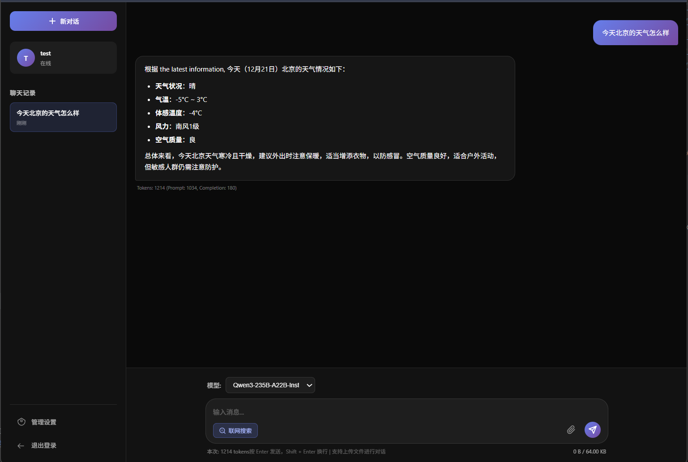
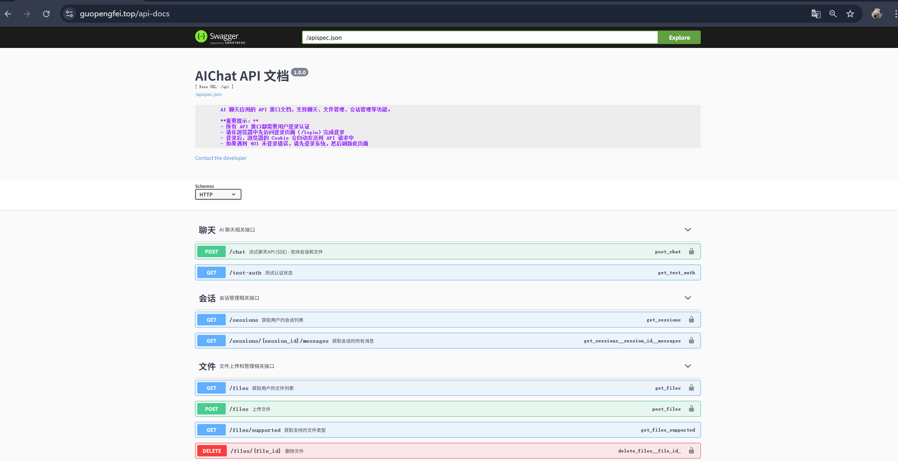
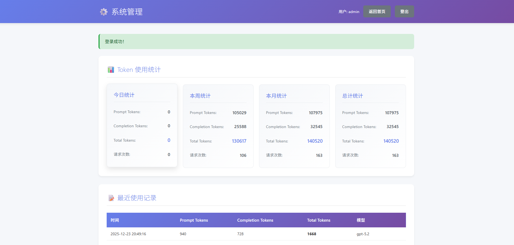

# AIChat - Flask AI 聊天应用 | Docker 全栈部署方案

> **Language / 语言**: [English](README_EN.md) | [中文](README.md)

[](https://opensource.org/licenses/MIT)
[](README_EN.md) [](README.md)
[](https://www.python.org/)
[](https://flask.palletsprojects.com/)
[](https://www.langchain.com/)
[](https://docs.docker.com/compose/)

> **5分钟搭建你自己的DeepSeek AI 聊天应用！Flask+LangChain 用户注册 + 公式显示 + 网络搜索 + 文件上传 + Token 统计 | Docker 一键部署，开箱即用**

## 项目简介

**AIChat** 是一个开源的 AI 聊天 Web 应用。项目使用 **Flask** 作为后端框架，集成了 **DeepSeek API** 提供 AI 聊天服务。通过 **Docker Compose** 实现一键部署。





###  核心特性

-  **AI聊天功能**：集成 DeepSeek API，支持实时对话交互，上传文件，支持公式/代码/markdown的格式化显示
-  **用户认证**：Bearer Token 登录/注册（React SPA + Flask API）
-  **使用统计**：Token 使用量统计和记录查询
-  **管理后台**：全局 Token 统计（React Admin 页）
-  **容器化部署**：Nginx + React + Flask + MySQL + Redis 一键部署
-  **政企风格 UI**：Ant Design 5 统一界面

###  在线演示

- **部署地址**: https://guopengfei.top
- **作者邮箱**: wisdomfriend@126.com（有问题欢迎发邮件）

### ️ 技术标签

`Flask` `Python` `Docker` `DeepSeek API` `LangChain`


## 快速开始

### 前置要求

- Docker (版本 20.10+)
- Docker Compose (版本 5.0.0，最低要求 1.29+)
- Python 3.9+ (本地开发需要)

### 国内网络优化配置

如果你在中国大陆，建议配置国内镜像源以加速下载：

#### 1. 配置 Docker 镜像加速器

创建或编辑 `/etc/docker/daemon.json`：

```bash
sudo mkdir -p /etc/docker
sudo tee /etc/docker/daemon.json <<-'EOF'
{
  "registry-mirrors": [
    "https://docker.mirrors.ustc.edu.cn",
    "https://hub-mirror.c.163.com",
    "https://mirror.baidubce.com"
  ]
}
EOF

# 重启 Docker 服务使配置生效
sudo systemctl daemon-reload
sudo systemctl restart docker

# 验证配置
docker info | grep -A 10 "Registry Mirrors"
```

**常用国内镜像源：**
- 中科大：`https://docker.mirrors.ustc.edu.cn`
- 网易：`https://hub-mirror.c.163.com`
- 百度云：`https://mirror.baidubce.com`
- 阿里云：需要登录阿里云控制台获取专属加速地址

### 启动服务

```bash
# 构建并启动所有容器
docker-compose up -d

# 查看所有服务日志
docker-compose logs -f

# 查看特定服务日志
docker-compose logs -f flask-app

# 停止服务
docker-compose down

```

#### 访问服务

启动容器后，通过 Nginx 统一入口访问（HTTPS 需配置 `ssl/` 证书）：

- **Web 应用（React SPA）**: `https://your-domain/` 或本地 `http://localhost/`
- **API 文档**: `/api-docs`（经 Nginx 代理到 Flask）
- **健康检查**: `/health`

开发模式下可分别启动前后端：

```bash
# 终端 1：Flask API
python run.py

# 终端 2：React 前端
cd frontend
npm install
npm run dev
```

浏览器访问 `http://localhost:5173`，API 默认同源或通过 `VITE_API_BASE_URL` 指向 Flask。


## 开发说明

### 本地开发

#### 前置要求

- Python 3.11

#### 设置 Python 虚拟环境

**推荐使用 venv（Python 内置虚拟环境）**

1. **创建虚拟环境**

```bash
# Windows PowerShell
python -m venv venv
```

2. **激活虚拟环境**

```bash
# Windows PowerShell
.\venv\Scripts\Activate.ps1

# 如果遇到执行策略错误，运行以下命令：
# Set-ExecutionPolicy -ExecutionPolicy RemoteSigned -Scope CurrentUser

# Windows CMD
venv\Scripts\activate.bat
```

激活成功后，命令行提示符前会显示 `(venv)`。

3. **安装 Python 依赖**

```bash
# 确保已激活虚拟环境（命令行前显示 (venv)）
pip install -r requirements.txt -i https://pypi.tuna.tsinghua.edu.cn/simple --trusted-host pypi.tuna.tsinghua.edu.cn
```

**常见问题：**

- 如果遇到 `ModuleNotFoundError`，检查是否已激活虚拟环境
- 在 PyCharm 中运行，确保已配置使用 venv 解释器
- 在终端中运行，确保先执行激活命令

### 修改代码后重新部署

```bash
# 重新构建并启动
docker-compose up -d --build
```

### 修改 Nginx 配置

修改 `nginx/nginx.conf` 后：
```bash
# Nginx 使用官方镜像，配置通过 volumes 挂载，直接重启即可生效
docker-compose restart nginx
```

## 配置说明

### Nginx 配置

主要配置项：
- **镜像**: nginx:alpine
- **配置挂载**: `nginx/nginx.conf` 通过 volumes 挂载，修改后重启即可生效
- **SPA**: `/` → React 静态资源 + fallback
- **API**: `/api/` → Flask（SSE 关闭缓冲）
- **反向代理**: 转发到 Flask 应用 (flask-app:5000)

### Flask 应用配置

- **运行端口**: 5000（容器内）
- **WSGI 服务器**: Gunicorn + gevent（SSE 流式）
- **数据库**: MySQL（通过环境变量配置）
- **表结构**: `backend/db/models.py`（SQLAlchemy ORM）
- **建表**: 进程首次连接数据库时执行 `create_all()`（幂等，仅创建缺失的表）
- **认证**: Bearer Token（`itsdangerous` 签名，`AUTH_TOKEN_SECRET`）
- **Redis**: 仅用于聊天 API 限流（`rate_limit:chat:*` 键）

### React 前端

- **目录**: `frontend/`
- **构建**: `npm run build` → 产物由 Nginx 挂载 `frontend_dist` volume
- **路由**: React Router（`/login`、`/chat`、`/dashboard`、`/admin`）

### MySQL 配置

- **版本**: MySQL 8.0
- **数据持久化**: Docker Volume
- **Schema 来源**: `backend/db/models.py`，由 backend 启动时 `create_all()` 自动建表（无 `init.sql`、无种子数据）

### Redis 配置

- **版本**: Redis 7 (Alpine)
- **数据持久化**: Docker Volume + AOF
- **用途**: 聊天 API 访问频率限制（非 Session 存储）


## 故障排查

### 常见问题

1. **容器无法启动**
   ```bash
   # 查看详细日志
   docker-compose logs
   # 检查端口占用
   netstat -tulpn | grep :80
   ```

2. **数据库连接失败**
   ```bash
   # 检查 MySQL 容器状态
   docker-compose ps mysql
   # 查看 MySQL 日志
   docker-compose logs mysql
   ```

3. **Redis 连接失败**
   ```bash
   # 检查 Redis 容器状态
   docker-compose ps redis
   # 查看 Redis 日志
   docker-compose logs redis
   # 测试 Redis 连接
   docker-compose exec redis redis-cli -a Gpf_learning ping
   ```
   - 检查环境变量 `REDIS_HOST`、`REDIS_PORT`、`REDIS_PASSWORD` 是否正确配置

## TODO / 开发计划

以下是计划中的功能改进和优化：

1. ✅ **Redis 限流**
   - ✅ 添加 Redis 服务到 Docker Compose
   - ✅ 聊天 API 多层级滑动窗口限流
   - ✅ Bearer Token 认证（已替代 Redis Session）

2. ✅ **实现流式聊天响应**
   - ✅ 修改 `/api/chat` 接口支持流式输出
   - ✅ 前端实现 Server-Sent Events (SSE) 或 WebSocket 接收流式数据
   - ✅ 减少用户等待时间，提升交互体验

3. ✅ **API 访问频率限制**
   ✅ - 使用 Redis 实现聊天 API 访问频率限制
   ✅ - 限制规则：1 分钟内最多访问 5 次
   ✅ - 基于用户 ID 进行限流
   ✅ - 返回友好的错误提示信息
4. ✅ **显示优化**
   - ✅ 支持markdown/公式/代码的格式化显示,使用KaTeX/Marked.js/Highlight.js
5. ✅ **文件对话**
   - ✅ 支持pdf/docx/xlsx文件对话
6.  **对话优化**
     - ✅ 超长上下文自动总结
     - ✅ 支持网络搜索
     - 支持MCP工具调用
     - 增加对话主题的修改和删除
     - 增加收藏功能
     - 增加对话内容/上传文件的删除功能
     - 上下文总结时增加提示
     - 联网搜索改为从直接调用百度接口,而不是通过爬虫的模式
     - 支持图片输入
7.  **higress部署**
    - 增加higress部署
8. **langchain agent的使用**
    - langchain agent的使用
## 许可证

本项目采用 [MIT License](LICENSE) 许可证。
详细许可证内容请查看 [LICENSE](LICENSE) 文件。
